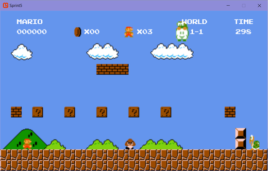

# Super Mario Bros. Clone
## Introduction
- A Full Super Mario Bros. Clone built from scratch with sprite and sound file from Nintendo.
- Built in C# using Microsoft XNA framework.

## Game Controls
- P for Pause
- Q for Quit
- R for Reset
- End for Shortcut to castle

Player Keyboard Controls:
- WASD or Arrow keys for moving 
- Z for Jumping
- X for Running or Shooting fireball

Gamepad controls:
- Up, Down, Left and Right button for Player movement
- A for Jumping
- B for Running or Shooting fireball
## Additional Features
**Level 1-4**
Included: 
- Bowser 
- Princess 
- Fire wheel
- Different tiles and blocks

**New Enemy (Lakitu)**
Lakitu Features:
- moving left to right in the sky
-shoot red balls projectile that can damage player

**Enemy Controls**
- B for increase the speed of enemy
- N for change enemy direction
- M for decrease the speed of enemy
- Space for Enemy Jumping Control

**Cheatcode**
- Press A + X + W at the same time to get a extra live
- Press A + X + Up at the same time to turn mario into star mode
- Press A + X + Down at the same time to turn mario into Fire mode

**Achievement**
- Collect all coins in the level
- Completed the level in 60 seconds
- Kill all the enemies in the level
